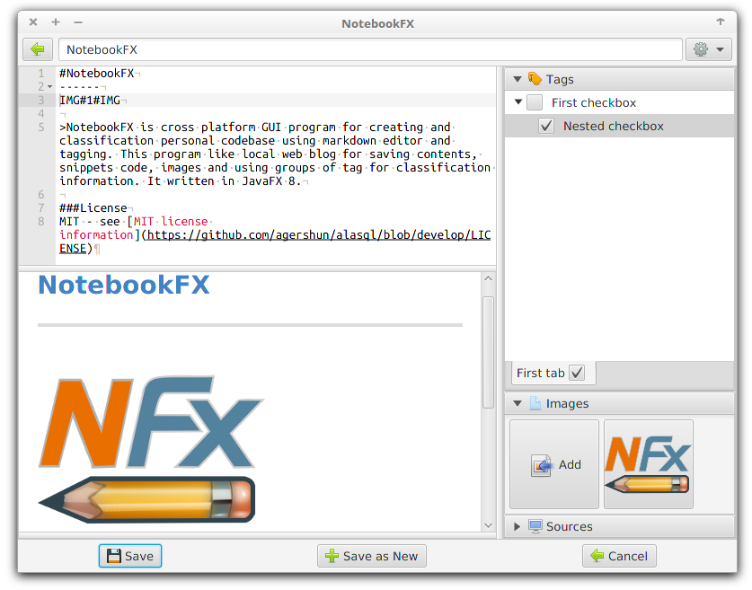
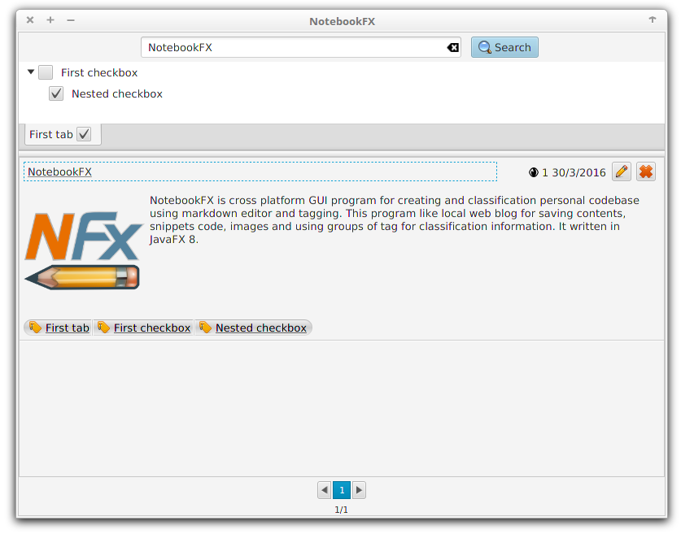
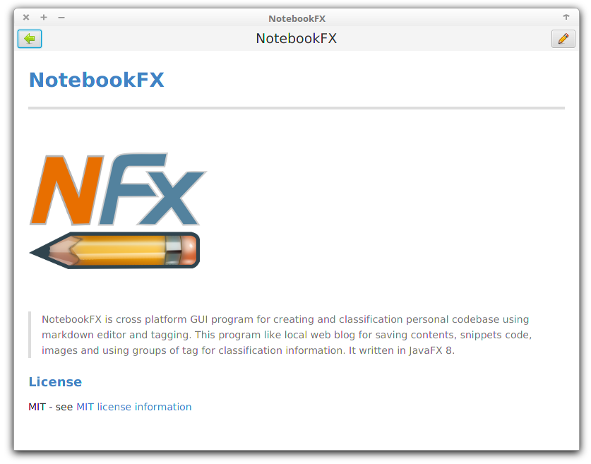

#NotebookFX

NotebookFX is cross platform GUI program for creating and classification personal codebase using markdown editor and tagging. This program like local web blog for saving contents, snippets code, images and using groups of tag for classification information. It written in JavaFX 8.

##Features

...

##ScreenShot

###Editor Preview

###Main Window Search Preview

### Viewer Preview

###Use Java libraries:

* [ControlsFX](https://bitbucket.org/controlsfx/controlsfx/)
* [SpringFramework](https://github.com/spring-projects/spring-framework)
* [Spring Data JPA](https://github.com/spring-projects/spring-data-jpa)
* [Hibernate ORM](http://hibernate.org/orm/)
* [Hibernate metamodel](http://hibernate.org/orm/tooling/)
* [H2 Database](http://www.h2database.com/html/main.html)
* [Pegdown](https://github.com/sirthias/pegdown)

###Use JavaScript Libraries:

* [Ace (Ajax.org Cloud9 Editor)](https://github.com/ajaxorg/ace)
* [Highlight.js](https://github.com/isagalaev/highlight.js)

###Use CSS:

* [GitHub stylesheet for MarkdownPad](https://github.com/nicolashery/markdownpad-github)

###Icons:

* http://sekkyumu.deviantart.com/art/Developpers-Icons-63052312
* http://prokofusha.deviantart.com/art/Basic-set-125164098

###License

MIT - see [MIT license information](https://github.com/agershun/alasql/blob/develop/LICENSE)

